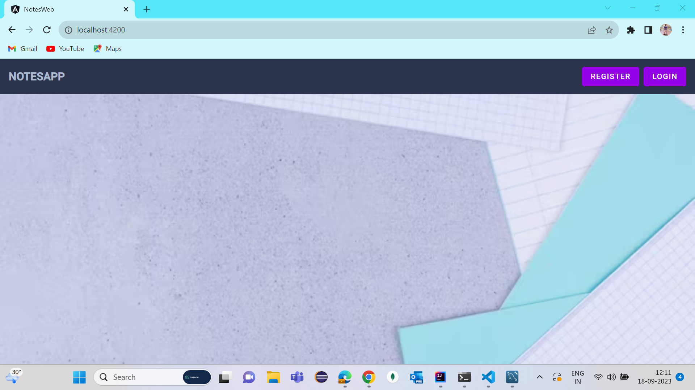
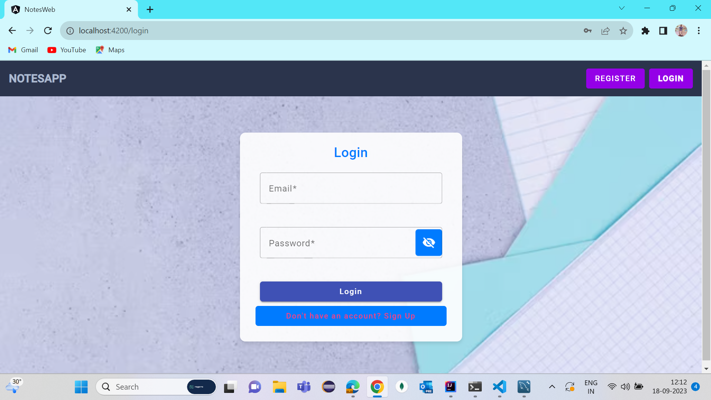
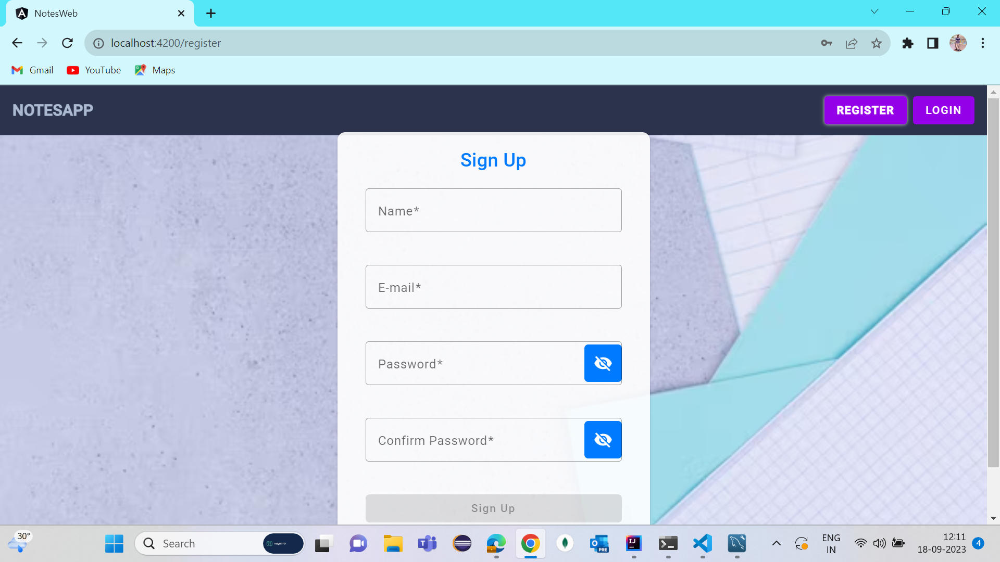
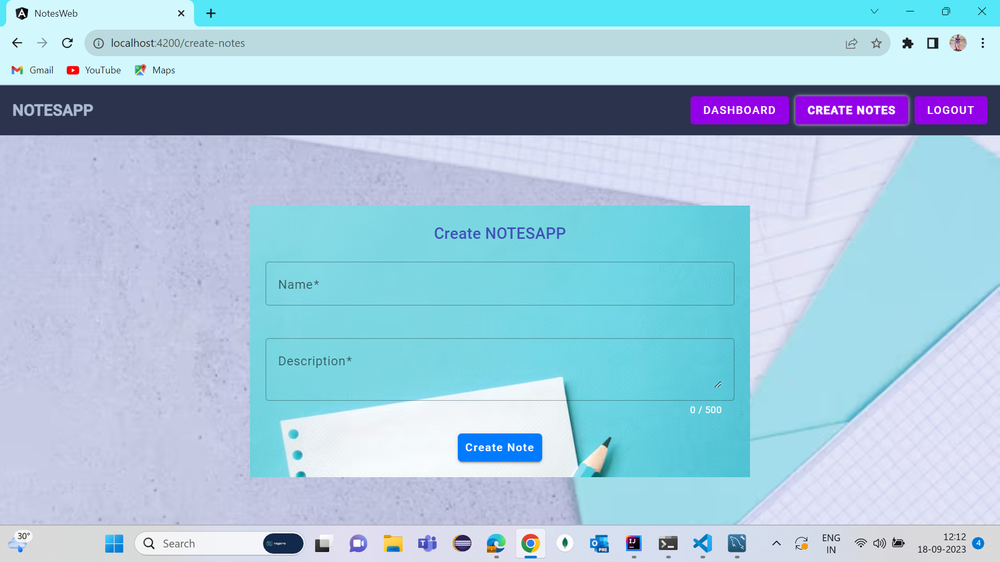
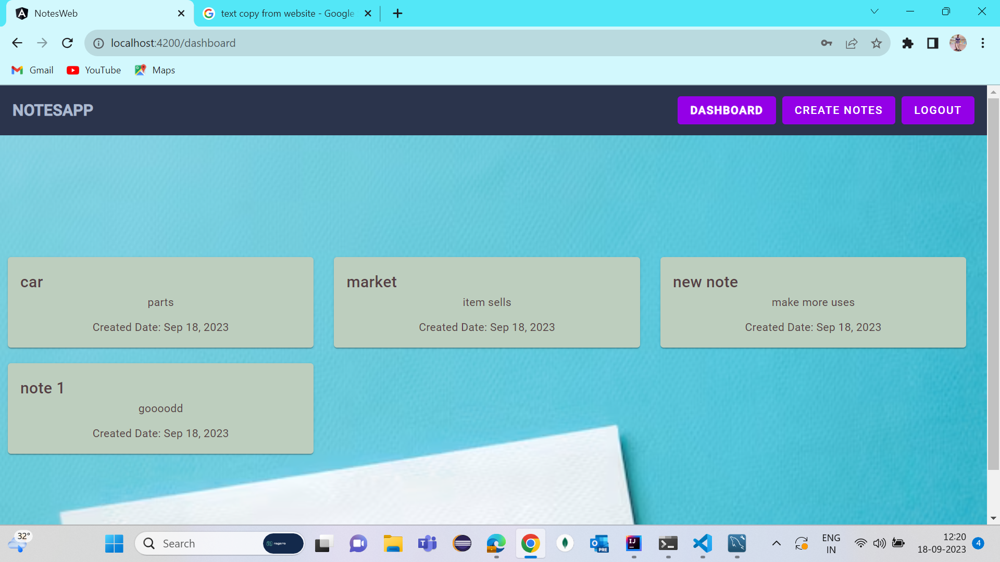

# NOTESAPP

Note Storage: The system stores user notes. User can add the notes.
User Login: Upon login, the API provides the user's 10 most recent notes.

#  How to run the Project 

## 
1. Open the project in Visual Studio Code.
2. Go to toolbar --> terminal --> Open new terminal.
3. Run "npm install"  .
4. Now to run the project --> Run "ng serve" on terminal.
5. Open URL "https://localhost:4200" on a browser.

### SCREENSHOTS
  
#Home page

 #Login Page

  

 #Register page

 

 #CreateNote Page

  

#Dashboard

   